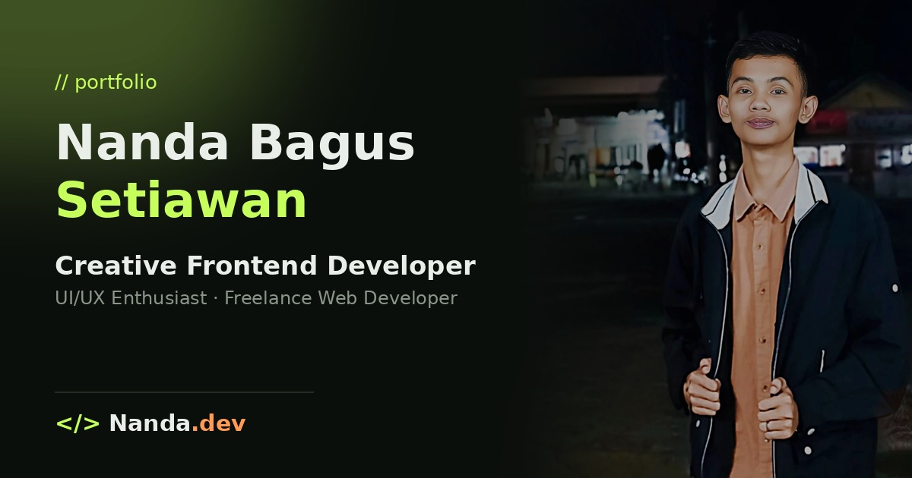

  

<h1 align="center">Hello world, I'm Nanda Bagus Setiawan</h1>

Creative Frontend Developer &middot; UI/UX Enthusiast &middot; Freelance Web Developer

<!--
**nbagus-setiawan/nbagus-setiawan** is a special repository because its `README.md` (this file) appears on your GitHub profile.
-->

 

 Currently working on **various web & software projects**
 
 Currently learning **new frameworks & tools**
 
 Looking to collaborate on **open source projects**
 
 Ask me about **JavaScript, PHP, Python, Java, atau C++**
 
 Reach me: **Nandabagus913@gmail.com**

 

##  Languages & Tools

**Programming Languages**

  

**Frontend**

  

**Backend & Frameworks**

  

**Database**

  

**Tools & Platform**

  

 

##  GitHub Stats

  
  

  

 

##  Connect with me

  
  &nbsp;
  
  &nbsp;
  
  &nbsp;
  

 

  

